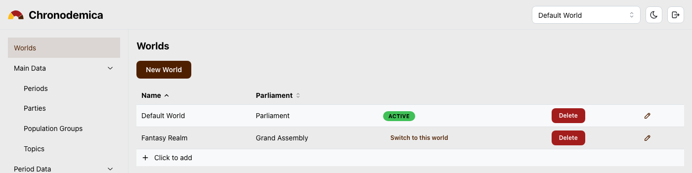
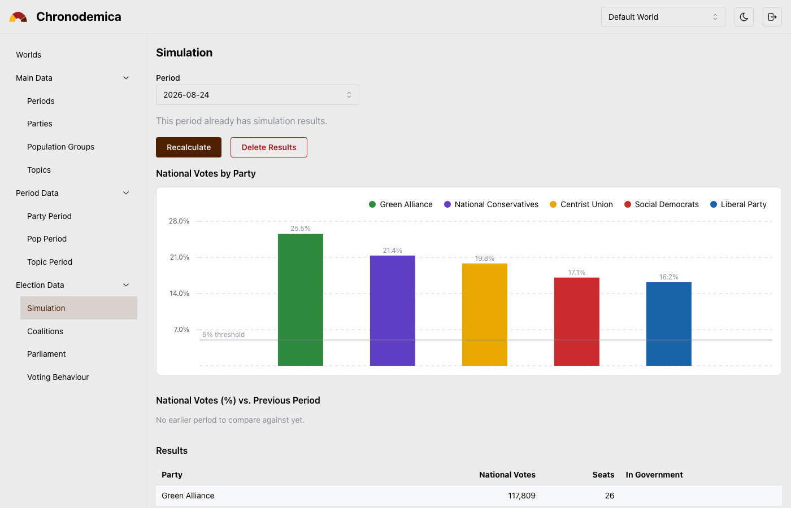
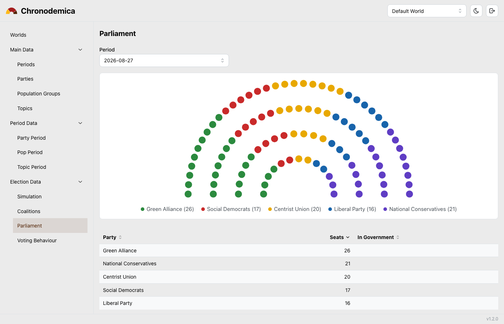

# Chronodemica

Chronodemica is a worldbuilding tool for simulating population dynamics, voting behaviour, and
election outcomes over time. Define population groups and political parties, give them opinions
on policy topics, and let the simulation turn that into votes, seat allocations, and a parliament
you can watch evolve from one election to the next.

It is a hobby project, built for worldbuilders, writers, and anyone who enjoys tinkering with
"what if" political scenarios — as well as for fun with simulation and data visualisation in
general.

## Screenshots

**Worlds** — every account can hold multiple independent worlds; switch between them from the
header or manage them here.



**Election simulation** — national vote share by party, checked against the electoral threshold.



**Parliament** — seat allocation rendered as an interactive hemicycle.



## How it works

A **world** holds your parties, population groups (pops), and policy topics. Each topic has one
or more **statements** — concrete positions a party can take on it (for example, a topic
"Taxation" might have statements like "Lower income tax" or "Raise corporate tax").

A **period** represents a legislative term — the stretch of time between one election and the
next, with its own voting system and parliament size. The election that opens it is a snapshot in
time: it fixes the topic importances, party popularity, pop sizes, turnout, and eligibility as
they stand on voting day. Within a period, each party endorses one statement per topic, and each
pop distributes its approval across a topic's statements by percentage.

Running the simulation for a period combines all of this — topic importance, statement approval,
and party popularity — into a score per party for each population group, turns those scores into
votes, applies the voting system's threshold, and apportions parliament seats (currently via the
Sainte-Laguë method). The result is that period's election outcome, which can be compared against
the previous period, explored seat by seat in the parliament hemicycle, or drilled down per
population group to see exactly which statements drove the outcome.

## Features

- Multiple independent worlds per account, each with its own parties, pops, topics, and history
- Political parties with configurable colors, founding/dissolution years, and left-right seat
  orientation
- Population groups with configurable size, turnout, and eligibility, tracked across periods
- Policy topics and statements, with per-period importance and approval
- Election simulation with proportional representation, an electoral threshold, and Sainte-Laguë
  seat apportionment
- Parliament view with an interactive hemicycle diagram and manual government/opposition marking
- Minimal winning coalition finder
- Voting behaviour drill-down, showing exactly how a population group's approval broke down by
  topic, statement, and party
- World export and import as a single portable SQLite file, for backups or sharing a world
- One-click demo data seeding to explore the app without building a world from scratch
- Light and dark themes
- Multi-user authentication via OIDC; the first person to ever log in becomes the sole,
  permanent admin, everything else is scoped per world

## Tech stack

- **Backend**: FastAPI, SQLModel, SQLite, managed with [uv](https://docs.astral.sh/uv/)
- **Frontend**: React, TypeScript, Vite, Mantine

## Running locally

### Prerequisites

- Python 3.12+ and [uv](https://docs.astral.sh/uv/)
- Node.js 20+ and npm

### Configure OIDC

Login is exclusively via OIDC, so the backend needs your provider's credentials before it can
start. The template lives at `backend/.env.example`; copy it to `backend/.env` (same folder,
right next to it) and fill in the real values:

```bash
cp backend/.env.example backend/.env
```

`backend/.env` is where all backend configuration — including the OIDC parameters
(`OIDC_ISSUER`, `OIDC_CLIENT_ID`, `OIDC_CLIENT_SECRET`, `OIDC_REDIRECT_URI`, `OIDC_SCOPES`) and
`SESSION_SECRET_KEY` — is actually maintained; `backend/.env.example` is only the checked-in
template and is never read by the app itself. `backend/.env` is git-ignored, so your real secrets
never end up in the repo — never put real credentials into `.env.example`. See the comments in
`backend/.env.example` for what each value means and where to get it from your provider (the
callback/redirect URI you register there must match `OIDC_REDIRECT_URI` exactly).

### Backend

```bash
cd backend
uv sync
uv run uvicorn app.main:app --reload --port 8010
```

### Frontend

In a second terminal:

```bash
cd frontend
npm install
npm run dev
```

Open the app at `http://localhost:5173` and log in — the first person to complete a login
becomes the sole, permanent admin, and can then create their first world.

## Running with Docker

Every push to `master` builds and publishes ready-to-use images to the GitHub Container Registry,
so self-hosting Chronodemica does not require a local build. Save the following as
`docker-compose.yml`:

```yaml
services:
  backend:
    image: ghcr.io/codingbeanie/chronodemica_redux-backend:latest
    ports:
      - "8010:8010"
    environment:
      DATABASE_URL: sqlite:////data/chronodemica.db
      CORS_ORIGINS: '["http://localhost:5173"]'
      FRONTEND_URL: http://localhost:5173
      SESSION_SECRET_KEY: ${SESSION_SECRET_KEY:?set a long random value}
      OIDC_ISSUER: ${OIDC_ISSUER:?set your OIDC provider's issuer URL}
      OIDC_CLIENT_ID: ${OIDC_CLIENT_ID:?set your OIDC client id}
      OIDC_CLIENT_SECRET: ${OIDC_CLIENT_SECRET:?set your OIDC client secret}
      OIDC_REDIRECT_URI: http://localhost:8010/api/auth/oidc/callback
      OIDC_SCOPES: openid profile email
    volumes:
      - backend_data:/data
    restart: unless-stopped

  frontend:
    image: ghcr.io/codingbeanie/chronodemica_redux-frontend:latest
    ports:
      - "5173:80"
    depends_on:
      - backend
    restart: unless-stopped

volumes:
  backend_data:
```

The `OIDC_*`/`SESSION_SECRET_KEY` values above are required — Compose will refuse to start
without them. Rather than editing them into `docker-compose.yml` directly, put a `.env` file next
to it (same directory) — Docker Compose reads that automatically and substitutes the `${...}`
placeholders:

```bash
# .env, next to docker-compose.yml
SESSION_SECRET_KEY=a-long-random-value
OIDC_ISSUER=https://your-provider.example.com
OIDC_CLIENT_ID=your-client-id
OIDC_CLIENT_SECRET=your-client-secret
```

(If you're doing this from a clone of this repo rather than a fresh directory, a template for
exactly this file already exists at `.env.example` in the repo root — `cp .env.example .env` and
fill it in, instead of typing the above by hand. Either way, this root-level `.env` is only for
Docker Compose's own variable substitution — it's unrelated to `backend/.env` from the local-dev
setup above, which is what the backend reads when *not* running under Docker. Both are git-ignored,
so real secrets never end up committed.)

Then start it with:

```bash
docker compose up -d
```

The frontend will be available at `http://localhost:5173` and the backend at
`http://localhost:8010`. Application data is stored in a Docker volume, so it persists across
restarts and image updates. To upgrade to the latest published image, run
`docker compose pull && docker compose up -d` again.

This same repository can still be built locally instead — see `backend/Dockerfile` and
`frontend/Dockerfile` — for example while developing against a modified copy of the code.

## AI disclaimer

This project was built with the help of Claude (Anthropic), as a hobby and learning exercise.
